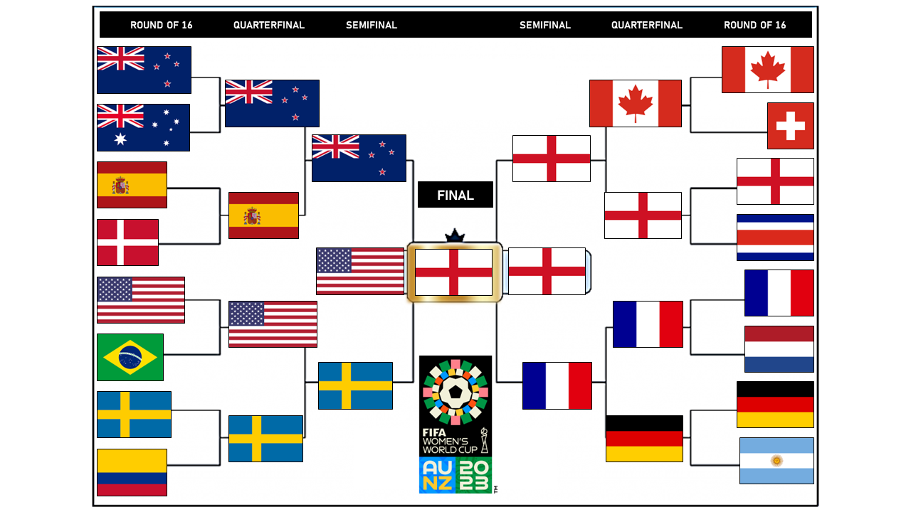

# 2023 FIFA Women's World Cup - A Prediction Model
Simulating the 2023 FIFA Women's World Cup which has the backdrop of being injury/missing player central, and taking place in peak summer down under. What could go wrong, eh?

Inspired by previous work on the 2022 Men's edition that championed the importance of the story that the data tells us, and the power and responsibility we hold because of it.

The 2022 Men's WC brought light to the island nation of Qatar (and how a tiny island nation that has never even qualified for a world cup finals hosted it). In the process of this work, we hope to unravel the ways the Women's WC differs from the Men's, how the gameplay itself is maybe different, and most especially, the teams(such as the USWNT, the Lionesses and the Matildas).

A simple Logistic Regression model was trained on data from past international matches. Patterns in the data were summarized in the form of two important features - the average scorring patterns and the frequency of recent results and their outcomes. Since the ability to score goals has been historically imperative to reaching the final stages of the tournaments, the average scoring pattern fo recent matches is idealized to define the teams' form coming into the tournament. In a results-oriented sport like football, teams are also impacted by recent results. Mentalities can change depending on if they come into the tournament on the back of long winning or losing streaks. Even though the dataset was devoid of FIFA rankings, the assumption was made, based on past tournament trends, that incorporating these rankings into the final statistics would only improve the prediction model's performance.

The results were compared against a purely FIFA rankings-based prediction model. The predictions will also be compared against the actual tournament results. 

On the eve of the World Cup, the model predicts England to win it. 

